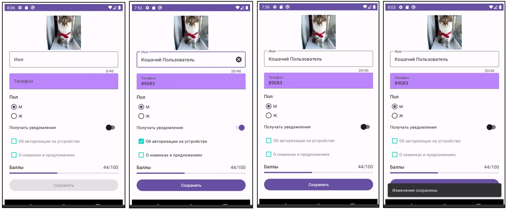
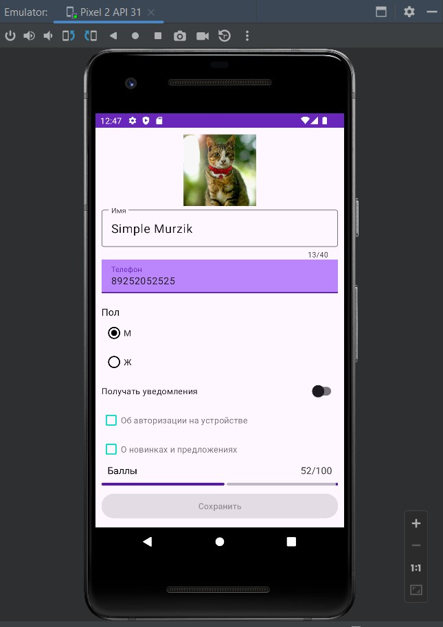
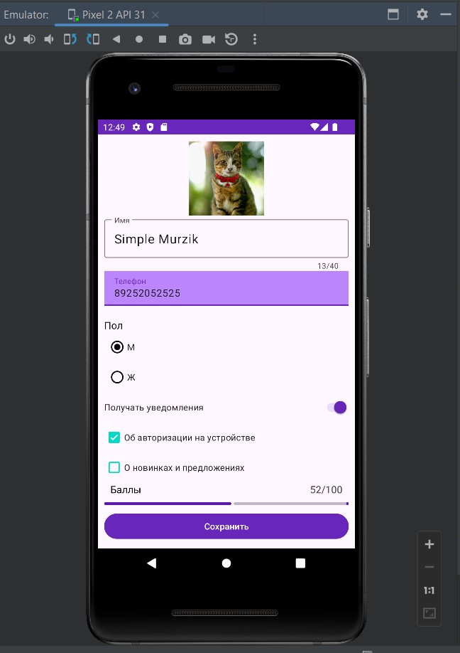
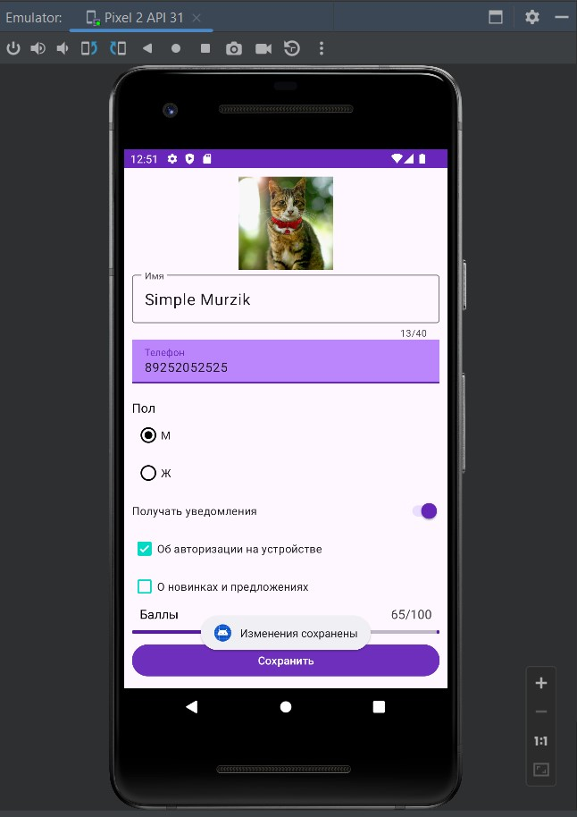

# Урок 4. Основные компоненты пользовательского интерфейса
Цели практической работы
 ● Научиться применять базовые компоненты пользовательского
 интерфейса.
 ● Создать экран профиля пользователя, используя такие компоненты, как
 TextView, ImageView, TextInputLayout/TextInputEditText,
 RadioButton/RadioGroup, MaterialCheckBox, SwitchMaterial,
 LinearProgressLayout, Button, Snackbar, Toast.

Что нужно сделать
 Создайте экран профиля пользователя, к элементам которого применены
 стили и который имеет следующий вид:

Требования:
Экран состоит из следующих компонентов:
 1. Фото пользователя. Квадратное изображение размером 120 × 120 dp.
 Добавьте подходящее изображение. Для оптимального отображения
 картинки попробуйте воспользоваться разными scale type.
 2. Имя. Поле для ввода текста. Текстовая клавиатура, ограничение на ввод
 —неболее40символов. Доступна опция удаления текста.
 3. Телефон. Поле для ввода текста. Тип ввода — номер телефона.
 Применён стиль FilledBox, цвет фона — фиолетовый (#BB86FC).
 4. Заголовок «Пол». Стиль: размер текста — 16 sp, цвет текста — чёрный
 (#000000).
 5. RadioGroup с заголовком для выбора пола.
 6. Switch для включения/отключения уведомлений.
 7. Два checkbox для выбора уведомлений, которые пользователь хочет
 получать. Стиль: цвет — бирюзовый (#03DAC5).
 8. Заголовок «Баллы». Стиль: размер текста — 16 sp, цвет текста —
 чёрный (#000000).
 9. Линейный прогресс отображает количество баллов пользователя от 0 до
 100.
 10.Текстовая информация о количестве баллов. Стиль: размер текста —
 16 sp, цвет текста — серый (#444444).
 11.Кнопка сохранения.

Логика работы линейного прогресса
 Установите значение прогресса и текстового поля, описывающее прогресс
 случайным образом с помощью  Random.nextInt(101)  который вернёт число от 0 до 100 включительно.

 Логика работы кнопки «Сохранить»
 Кнопка активна, если выполняются все следующие условия:
 1. значение в поле «Имя» введено корректно, то есть поле не пустое и
 количество символов не превышает 40;
 2. значение в поле «Телефон» введено корректно, то есть поле не пустое;
 3. выбран пол;
 4. если активен переключатель, должен быть выбран хотя бы один вид уведомлений.
 При нажатии на активную кнопку «Сохранить» показывается уведомление о
 том, что информация сохранена.

===========================================================================
## Демонстрация решения:

